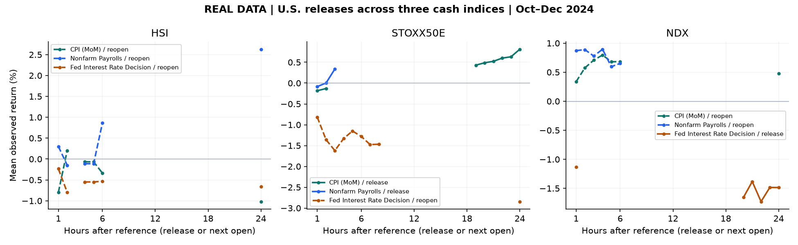
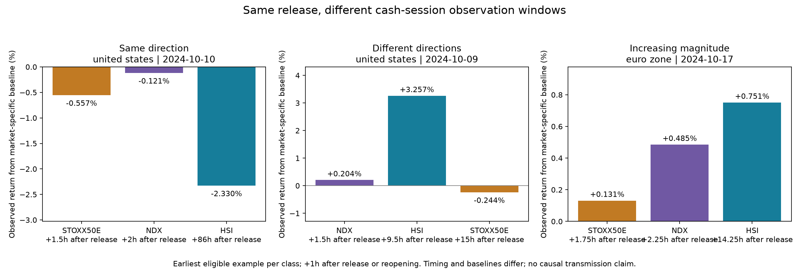
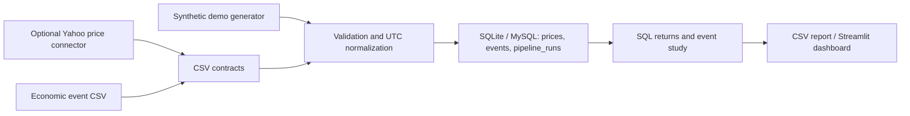

# Economic Events Across Global Cash Equity Sessions

**How do major cash equity indices respond around economic announcements when
Asian, European, and U.S. markets are open at different times?**

This project starts with that question, integrates Yahoo Finance price observations
and an Investing.com economic-calendar archive in SQL, and examines the resulting
session-aware responses. It originated in a Biological Databases course during an
MSc in Bioinformatics and has been reworked as an empirical Python / SQL side project.

The actual study uses **Hang Seng (`^HSI`), EURO STOXX 50 (`^STOXX50E`), and
Nasdaq-100 cash (`^NDX`)**, with a common window of **2024-10-08 to 2024-12-30**.
The original `NQ=F` futures series has been replaced with actual Nasdaq cash data.
Regular sessions overlap but do not cover 24 hours; DST, lunch breaks, holidays
and reopening waits are part of the analysis rather than discarded details.

The project demonstrates data contracts, UTC normalization, relational modeling,
transactional upserts, ingestion audit records, SQL window functions, and automated
checks. It is a local batch pipeline; it does not claim production deployment,
large-scale processing, or profitable trading performance.

## View the project

- [Public presentation (3-page PDF)](docs/presentation_public.pdf): research question,
  corrected session chart, actual source-to-SQL workflow, and observed results.
- [Actual results](results/real/README.md): response curves, heatmap, mean/median/count
  summaries, calendar examples, and source/artifact hashes.
- [Methodology and original time-chart audit](docs/real-study.md).
- [Offline synthetic fixture](results/README.md): a separate reproducible execution demo.



Streamlit remains the interactive application: `streamlit run dashboard.py`.
These static exports let visitors inspect results directly on GitHub.

## What was observed?

**Do the three markets move in the same direction around the same release, and
are later observed moves larger?** SQL groups co-released indicators by country
and UTC release time, then compares each market's nominal +1h observation after
release (if open) or its next session opening (if closed).

Of 124 event records, there are 85 release clusters; **73 have valid observations
in all three markets**, while 12 are excluded. With a ±0.1% neutral band:

| Cross-market outcome | Releases | Share of 73 |
| --- | ---: | ---: |
| All three positive | 8 | 11.0% |
| All three negative | 5 | 6.8% |
| At least one positive and one negative | 47 | 64.4% |
| Remaining cases involving neutral moves | 13 | 17.8% |

Thus **17.8% move in the same direction** beyond the threshold. In **4/73 (5.5%)**,
all three move in the same direction and absolute returns increase strictly in
actual observation-time order (4/13, or 30.8%, of same-direction cases).
These percentages describe this Q4 sample and these measurement rules, rather
than the probability that an announcement causes a particular market response.



Examples are the **earliest qualifying release in each class**, selected by SQL
classification rather than by the largest return:

- **2024-10-10 U.S. CPI / jobless-claims release bundle:** Europe −0.557%, Nasdaq
  −0.121%, Hong Kong −2.330%. Observations are 1.5h, 2h and **86h** after release;
  Hong Kong's holiday/weekend gap makes the last return especially exposed to
  intervening news. This is a co-release example, not an isolated CPI effect.
- **2024-10-09 U.S. 10-year note auction:** Nasdaq +0.204%, Hong Kong +3.257%,
  Europe −0.244%, observed after 1.5h, 9.5h and 15h respectively.
- **2024-10-17 ECB interest/deposit-rate release bundle:** Europe +0.131%, Nasdaq
  +0.485%, Hong Kong +0.751%, observed after 1.75h, 2.25h and 14.25h.
  The later observations are larger; this alone does not establish transmission
  from Europe to America to Asia.

**Answer:** responses in this sample frequently differ across markets. Larger
later observations exist, but different baseline intervals, regional index
composition, simultaneous releases and intervening news can also explain them.
The analysis measures association around announcements; it does not isolate
their causal impact. See the [SQL and classification method](results/cases/README.md),
[all release classifications](results/cases/release_classifications.csv), and
[threshold sensitivity](results/cases/threshold_sensitivity.csv).

The actual run retains 1,024 full cash-session hourly bars and 124 timed
high-importance events. For the three U.S. CPI (MoM) releases, Europe is open at
release while Hong Kong and U.S. cash trading are closed. At the nominal +1h target,
the European mean observed return is -0.184% (median -0.134%, n=3); Nasdaq's next-opening
mean is +0.336% (median -0.121%, n=3); Hong Kong's next-opening mean is -0.797%
(median -0.543%, n=3). **These are different information windows, not simultaneous
or causally identified CPI effects.** Mean elapsed time since release is 1.5h,
2.0h and 37.3h respectively; a Hong Kong holiday extends one reopening wait.

Read the [findings and limitations](results/real/findings.md). Small samples,
co-released indicators, different baseline windows, and intervening news prevent
strong economic conclusions. The main lesson is that market availability changes
what an “event response” can actually measure.

## Run the real study

Install `requirements-study.txt` and supply the sourced Yahoo/Investing archives:

```sh
python -m pip install -r requirements-study.txt
python fetch_cash_prices.py --market NDX --start 2024-10-08 --end 2024-12-31
python study.py prepare --hsi HSI_1h_UTC.csv --stoxx STOXX50E_1h_UTC.csv --ndx data/raw/NDX_1h_yahoo.csv --events economic_calendar_data_final.csv --event-timezone UTC
python build_real_report.py
python build_case_report.py
streamlit run dashboard.py
```

The source datasets remain local; reproducing the exact empirical snapshot requires
the archives identified by the manifest. Yahoo hourly retention can prevent later
redownloads. [Detailed setup](docs/real-study.md) includes MySQL execution and source
contracts. The synthetic path below remains runnable without private/provider data.



## Run the offline demo

Python 3.10+ is required. The pipeline and tests need no third-party packages.

```sh
python pipeline.py demo
python -m unittest discover -s tests -v
```

The demo creates 288 synthetic hourly prices across three fictional instruments,
three events, and nine 24-hour responses. Repeating it updates existing records
without duplicating prices or events; each successful ingestion records a run.
Working files stay in ignored `data/` and `outputs/` directories. A curated
synthetic results bundle is intentionally tracked in `results/`.

For the optional dashboard and live price connector:

```sh
python -m venv .venv
# Windows: .venv\Scripts\activate
# macOS/Linux: source .venv/bin/activate
python -m pip install -r requirements.txt
streamlit run dashboard.py
```

The dashboard provides 1–24 hour event-response curves and annual event heatmaps,
with log/percentage returns, observation counts, alignment records, and CSV export.
Real-study views separate open-at-release and closed-at-release markets. Heatmaps
use a selected hourly horizon after the appropriate reference, not the original
daily next-day calculation. The dashboard selects the local real-study DB when available.
For the executable MySQL/SQLAlchemy backend, see [MySQL setup](docs/mysql.md).
The [coursework context](docs/coursework.md) explains the original data flow and
what changed during the refactor.

## Ingest your own data

Prices CSV:

```csv
instrument,timestamp_utc,close
MY_INDEX,2024-01-02T13:00:00+00:00,100.50
```

Events CSV:

```csv
name,country,timestamp_utc,importance
Policy announcement,United States,2024-01-02T13:00:00+00:00,High
```

```sh
python pipeline.py ingest --prices data/prices.csv --events data/events.csv --db data/real.db --output outputs/real_responses.csv
python pipeline.py analyze --db data/real.db --horizon 1 --output outputs/one_hour.csv
```

Use a separate database for real data to avoid mixing it with the synthetic demo.
Input timestamps must contain a UTC offset. Price timestamps must represent
**completed bar end times**. If your provider labels bars by start time, convert
them before ingestion. All Day announcements and unknown times require explicit
upstream handling; this pipeline rejects them instead of inventing midnight times.
Malformed rows, nonpositive/nonfinite prices, conflicting duplicates within a
batch, and empty inputs fail validation before any records are loaded.

The business keys are `(instrument, timestamp_utc)` for prices and a SHA-256 hash
of `(name, country, timestamp_utc)` for events. Corrections to prices or event
importance update existing rows. Changing an event's name/time creates a new key;
source-level reconciliation is outside this project's scope.

## Optional live price extraction

```sh
python pipeline.py fetch-prices --ticker '^NDX' --start 2026-09-28 --end 2026-10-02 --output data/prices.csv
```

Choose recent dates supported by the provider. This adapter uses `yfinance`,
not a directly implemented authenticated REST client. It normalizes hourly bar
start labels to end times. Availability, throttling, partial-session bars, and
provider retention limits require care; the offline demo is the reproducible path.
See the [official download documentation](https://ranaroussi.github.io/yfinance/reference/api/yfinance.download.html).
The adapter has no retry/backoff or incremental checkpointing yet.
Economic events use CSV ingestion; the original coursework used `investpy`.

## Offline generic analysis semantics

The session-aware empirical rules are documented [separately](docs/real-study.md).
The following describes the generic demo/CSV pipeline.

[`sql/analysis.sql`](sql/analysis.sql) calculates simple returns using `LAG(close)`
partitioned by instrument and ordered by UTC timestamp. The event report calculates
log returns between the latest completed bar at/before the event and the first
completed bar at/after the requested horizon. Both observations must be within one
hour of their respective reference times. Missing and distant bars are reported
explicitly and excluded from dashboard averages.

This is a descriptive event study. It does not establish causation, isolate
overlapping announcements, or control for market conditions. A one-hour base bar
can predate an intrahour event, so its return window can include pre-event moves.
DST is handled by supplied offsets and UTC normalization; ambiguous local times
must be resolved upstream. Markets here can include indices and futures; these
instrument types are not interchangeable. The coursework's strategy backtests
and reported historical returns are not shipped as validated results.

## Engineering choices and scope

- SQLite keeps the demo portable; `--db mysql` uses MySQL through SQLAlchemy and PyMySQL.
- Primary keys, constraints, and indexed timestamps encode the data model.
- Parameterized SQL and transactions support safe, repeatable loading.
- Run records capture input counts and source labels; they are not full lineage or failure monitoring.
- Tests cover repeated loads, invalid batches, duplicate conflicts, time offsets,
  per-instrument returns, event alignment, and missing trading-hour observations.
- GitHub Actions runs offline checks plus integration tests on a disposable MySQL 8.4 service.

Useful next steps would be migrations, source checksums and failure audit records,
scheduled incremental ingestion, authenticated economic-data connectors, provider
retries, and PostgreSQL deployment. These are future work, not implemented features.

## Repository contents

| Path | Purpose |
|---|---|
| `pipeline.py` | CLI, extraction adapter, validation, load, event report |
| `sql/` | Relational schema and window-function analysis |
| `database.py` | SQLite/MySQL connection boundary |
| `dashboard.py` | Streamlit response curves and event heatmaps |
| `results/real/` | Actual analytical summaries, session chart, and provenance |
| `results/` | Separate synthetic execution fixture |
| `study.py` | Yahoo/Investing source normalization and session-aware SQL analysis |
| `build_real_report.py` | Actual graphs, findings, and public presentation |
| `fetch_cash_prices.py` | Yahoo cash-index hourly acquisition |
| `build_portfolio.py` | Reproducible static results and PDF generator |
| `tests/` | Offline correctness checks |
| `.github/workflows/test.yml` | Continuous integration |
| `docs/publication.md` | Public/private file boundary and coursework changes |

CVs, original coursework presentations, original notebooks/scripts, provider
datasets, credentials, and working outputs stay local. The revised public PDF and
derived actual summaries and synthetic fixtures are explicitly included through `.gitignore`.
No provider dataset is redistributed with this repository.
