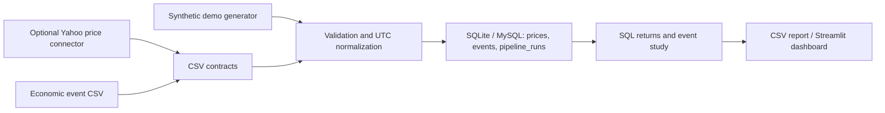

# Economic Event & Market Data Pipeline

A Python and SQL side project that turns timestamped market prices and economic
announcements into validated relational data and exploratory event responses.
Originally developed in a Biological Databases course during an MSc in
Bioinformatics, then reworked as a reproducible data engineering portfolio project.

The project demonstrates data contracts, UTC normalization, relational modeling,
transactional upserts, ingestion audit records, SQL window functions, and automated
checks. It is a local batch pipeline; it does not claim production deployment,
large-scale processing, or profitable trading performance.

## View the project

- [Public presentation (3-page PDF)](docs/presentation_public.pdf): coursework
  context, original and maintained SQL designs, and updated synthetic results.
- [Curated demo results](results/README.md): response curves, annual heatmap,
  CSV outputs, and a reproducibility manifest.


Streamlit remains the interactive application: `streamlit run dashboard.py`.
These static exports let visitors inspect results directly on GitHub.



## Run the offline demo

Python 3.10+ is required. The pipeline and tests need no third-party packages.

```sh
python pipeline.py demo
python -m unittest discover -s tests -v
```

The demo creates 288 synthetic hourly prices across three fictional instruments,
three events, and nine 24-hour responses. Repeating it updates existing records
without duplicating prices or events; each successful ingestion records a run.
Working files stay in ignored `data/` and `outputs/` directories. A curated
synthetic results bundle is intentionally tracked in `results/`.

For the optional dashboard and live price connector:

```sh
python -m venv .venv
# Windows: .venv\Scripts\activate
# macOS/Linux: source .venv/bin/activate
python -m pip install -r requirements.txt
streamlit run dashboard.py
```

The dashboard restores 1–24 hour event-response curves and annual event heatmaps,
with log/percentage returns, observation counts, alignment records, and CSV export.
Heatmaps use a selected hourly horizon, not the original daily next-day calculation.
For the executable MySQL/SQLAlchemy backend, see [MySQL setup](docs/mysql.md).
The [coursework context](docs/coursework.md) explains the original data flow and
what changed during the refactor.

## Ingest your own data

Prices CSV:

```csv
instrument,timestamp_utc,close
MY_INDEX,2024-01-02T13:00:00+00:00,100.50
```

Events CSV:

```csv
name,country,timestamp_utc,importance
Policy announcement,United States,2024-01-02T13:00:00+00:00,High
```

```sh
python pipeline.py ingest --prices data/prices.csv --events data/events.csv --db data/real.db --output outputs/real_responses.csv
python pipeline.py analyze --db data/real.db --horizon 1 --output outputs/one_hour.csv
```

Use a separate database for real data to avoid mixing it with the synthetic demo.
Input timestamps must contain a UTC offset. Price timestamps must represent
**completed bar end times**. If your provider labels bars by start time, convert
them before ingestion. All Day announcements and unknown times require explicit
upstream handling; this pipeline rejects them instead of inventing midnight times.
Malformed rows, nonpositive/nonfinite prices, conflicting duplicates within a
batch, and empty inputs fail validation before any records are loaded.

The business keys are `(instrument, timestamp_utc)` for prices and a SHA-256 hash
of `(name, country, timestamp_utc)` for events. Corrections to prices or event
importance update existing rows. Changing an event's name/time creates a new key;
source-level reconciliation is outside this project's scope.

## Optional live price extraction

```sh
python pipeline.py fetch-prices --ticker 'NQ=F' --start 2026-09-28 --end 2026-10-02 --output data/prices.csv
```

Choose recent dates supported by the provider. This adapter uses `yfinance`,
not a directly implemented authenticated REST client. It normalizes hourly bar
start labels to end times. Availability, throttling, partial-session bars, and
provider retention limits require care; the offline demo is the reproducible path.
See the [official download documentation](https://ranaroussi.github.io/yfinance/reference/api/yfinance.download.html).
The adapter has no retry/backoff or incremental checkpointing yet.
Economic events use CSV ingestion; the original coursework used `investpy`.

## Analysis semantics

[`sql/analysis.sql`](sql/analysis.sql) calculates simple returns using `LAG(close)`
partitioned by instrument and ordered by UTC timestamp. The event report calculates
log returns between the latest completed bar at/before the event and the first
completed bar at/after the requested horizon. Both observations must be within one
hour of their respective reference times. Missing and distant bars are reported
explicitly and excluded from dashboard averages.

This is a descriptive event study. It does not establish causation, isolate
overlapping announcements, or control for market conditions. A one-hour base bar
can predate an intrahour event, so its return window can include pre-event moves.
DST is handled by supplied offsets and UTC normalization; ambiguous local times
must be resolved upstream. Markets here can include indices and futures; these
instrument types are not interchangeable. The coursework's strategy backtests
and reported historical returns are not shipped as validated results.

## Engineering choices and scope

- SQLite keeps the demo portable; `--db mysql` uses MySQL through SQLAlchemy and PyMySQL.
- Primary keys, constraints, and indexed timestamps encode the data model.
- Parameterized SQL and transactions support safe, repeatable loading.
- Run records capture input counts and source labels; they are not full lineage or failure monitoring.
- Tests cover repeated loads, invalid batches, duplicate conflicts, time offsets,
  per-instrument returns, event alignment, and missing trading-hour observations.
- GitHub Actions runs offline checks plus integration tests on a disposable MySQL 8.4 service.

Useful next steps would be migrations, source checksums and failure audit records,
scheduled incremental ingestion, authenticated economic-data connectors, provider
retries, and PostgreSQL deployment. These are future work, not implemented features.

## Repository contents

| Path | Purpose |
|---|---|
| `pipeline.py` | CLI, extraction adapter, validation, load, event report |
| `sql/` | Relational schema and window-function analysis |
| `database.py` | SQLite/MySQL connection boundary |
| `dashboard.py` | Streamlit response curves and event heatmaps |
| `results/` | Small published synthetic graphs, CSVs, and manifest |
| `build_portfolio.py` | Reproducible static results and PDF generator |
| `tests/` | Offline correctness checks |
| `.github/workflows/test.yml` | Continuous integration |
| `docs/publication.md` | Public/private file boundary and coursework changes |

CVs, original coursework presentations, original notebooks/scripts, provider
datasets, credentials, and working outputs stay local. The revised public PDF and
curated synthetic results are explicitly included through `.gitignore`.
No provider dataset is redistributed with this repository.
