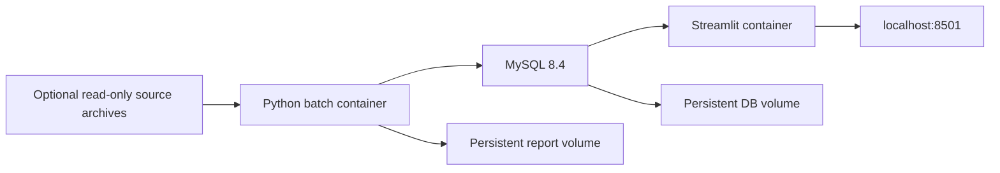

# Run the pipeline with Docker Compose

The public configuration runs an offline **synthetic demo** on MySQL 8.4 and
starts Streamlit. A separate overlay runs the real sourced study when its four
local archives are supplied. Neither mode downloads paid data.

Prerequisites: Docker Engine with Compose v2+ (Docker Desktop on Windows/macOS).
Start Docker Desktop and wait until its engine is running before the first command.

## One-command demo

```sh
docker compose up --build -d --wait --wait-timeout 240
```

Open <http://localhost:8501>. Streamlit automatically selects MySQL and labels the
data as synthetic. The first build downloads Python dependencies and MySQL; later
starts reuse the image and database volume. The batch container finishes with
exit code 0 while MySQL and Streamlit continue running.

```sh
docker compose ps --all
docker compose logs --tail 100 pipeline
docker compose logs --tail 100 dashboard
docker compose run --rm --no-deps pipeline python docker_smoke.py
docker compose run --rm --no-deps pipeline python -m unittest discover -s tests -v
# Export reports to the host (destination is ignored by Git):
docker compose cp pipeline:/app/outputs ./outputs/docker
# Stop containers; keep database and reports:
docker compose down
```

Create the host `outputs/` directory before exporting if it does not yet exist.
The demo creates 288 prices, 3 events and 216 response records. Repeated ingestion
keeps prices/events unique and appends an audit run. The smoke check verifies SQL
returns, report records and actual Streamlit script rendering against MySQL, rather
than only checking that its HTTP server starts.

## Components



- `Dockerfile` creates a Python 3.12 image and runs application processes as a
  non-root user. Shared code/dependencies serve both batch and dashboard commands.
  `requirements-docker.txt` pins the complete dependency set verified in the Linux
  image; update it deliberately and rerun container checks when dependencies change.
- `compose.yaml` waits for an authenticated MySQL health check before loading and
  for successful batch completion before starting the dashboard. MySQL has no
  host port; the dashboard port is bound to localhost.
- Named volumes preserve the database and exports across `down` / `up`. Logs go
  to container stdout/stderr with size limits. Failed batch runs block dashboard
  startup and do not automatically retry indefinitely.
- `.dockerignore` explicitly allows only public application/test/report files into
  the build context. It excludes original datasets, CVs, credentials and coursework.

## Real historical study

Create `data/container-input/` and place **only these four supplied archives** in it:

```text
HSI_1h_UTC.csv
STOXX50E_1h_UTC.csv
NDX_1h_yahoo.csv
economic_calendar_data_final.csv
```

Use a separate project so demo and real databases have separate volumes. Set
`EVENT_TIMEZONE=UTC` for the checked-in study's calendar archive; do not infer a
timezone for a different archive. In PowerShell:

```powershell
$env:EVENT_TIMEZONE = 'UTC'
$env:DASHBOARD_PORT = '8502'
docker compose -p economic-events-real -f compose.yaml -f compose.real.yaml up --build -d --wait --wait-timeout 300
docker compose -p economic-events-real -f compose.yaml -f compose.real.yaml run --rm --no-deps pipeline python docker_smoke.py --real
docker compose -p economic-events-real -f compose.yaml -f compose.real.yaml cp pipeline:/app/outputs ./outputs/docker-real
```

On Linux/macOS, use `export EVENT_TIMEZONE=UTC` and `export DASHBOARD_PORT=8502`
before the same Docker commands. Open <http://localhost:8502>.

The read-only mount is limited to the input directory. `REAL_INPUT_DIR`,
`STUDY_START`, `STUDY_END` and `EVENT_TIMEZONE` are configurable. You can instead
copy `.env.docker.example` to `.env` and edit these settings; Compose reads `.env`
automatically. This differs from direct Python CLI use, which does not load `.env`.

The real batch prepares the session-aware database and generates response curves,
heatmaps, cross-market release cases, optional forecast-surprise comparisons and
the public presentation. Exports are copied into `/app/outputs/real`, `cases`,
`surprises` and `presentation_public.pdf`. These are runtime results, not changes
to the host repository. Exact archive availability and hourly retention limitations
still apply. See [the source contracts](real-study.md).

## Credentials and eventual server use

Defaults are explicitly local demo credentials. Copy `.env.docker.example` to
`.env` and replace both passwords before remote use. Passwords are URL-encoded
inside the runner; no connection URL is printed. Existing database volumes retain
the credentials with which they were initialized, so editing `.env` alone does
not rotate a database password.

This configuration was verified on an AWS EC2 Linux host on 2026-10-07; see the
[AWS verification record](aws-verification.md). A localhost-only dashboard can
be viewed over an SSH tunnel after deployment. Public HTTPS, authentication,
cloud access roles, backup policy and scheduling remain future deployment work.

Docker lifecycle and dependency conditions follow the [Compose startup-order
documentation](https://docs.docker.com/compose/how-tos/startup-order/).

## Verification

On 2026-10-06, Docker Desktop's Linux engine successfully built the image and ran
both demo and supplied-archive configurations. The actual MySQL study reproduced
1,024 accepted bars, 124 events, 2,380 valid response rows and 73 complete cross-market
release comparisons. Both dashboards passed Streamlit rendering and HTTP health
checks. The demo passed repeated-load and stop/start persistence checks. The real
archives are private inputs and are not uploaded to GitHub Actions.

GitHub Actions additionally builds the image, starts the public demo stack, checks
SQL/report/dashboard behavior, runs the tests inside the image, and repeats the
checks after stopping and starting the services with the same volumes.
