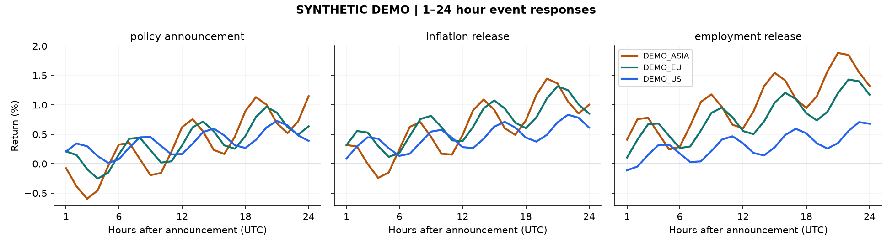
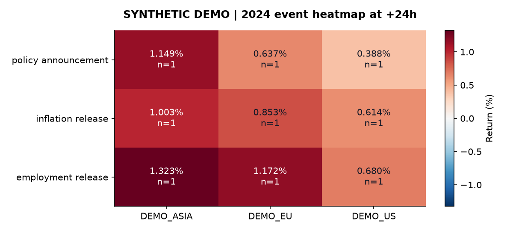

# Curated demo results

These are **synthetic**, reproducible pipeline outputs, not historical economic
or trading results. The small checked-in bundle lets readers inspect results
without installing Python or starting the Streamlit dashboard.





## Files

| File | Content |
|---|---|
| `synthetic_prices.csv` | 288 hourly prices for three fictional instruments |
| `synthetic_events.csv` | Three different synthetic announcements |
| `response_curve.csv` | 216 aligned event/instrument/horizon responses |
| `responses_24h.csv` | Nine observations at the 24-hour horizon |
| `response_curve.png`, `.svg` | Static curve exports |
| `event_heatmap.png`, `.svg` | Static annual heatmap exports |
| `manifest.json` | Generator, row counts, methodology, sizes, SHA-256 hashes |

The synthetic events have one occurrence per event/instrument, so heatmap cells
show `n=1`. Different instruments use different synthetic trajectories to make
the visual examples legible. Synthetic behavior has no financial interpretation.
Plots show `100 * expm1(log_return)`; CSVs preserve log returns and alignment status.

## Regenerate

```sh
python -m pip install -r requirements-report.txt
python build_portfolio.py
```

The script builds a fresh temporary SQLite database and uses the maintained
pipeline's validation, loading, and response functions. It also regenerates the
[public presentation](../docs/presentation_public.pdf). Report generation does not
use the original private datasets, CV, or stored credentials.

Daily working outputs and databases remain ignored in `outputs/` and `data/`.
Only this deliberately curated results bundle is checked in.
