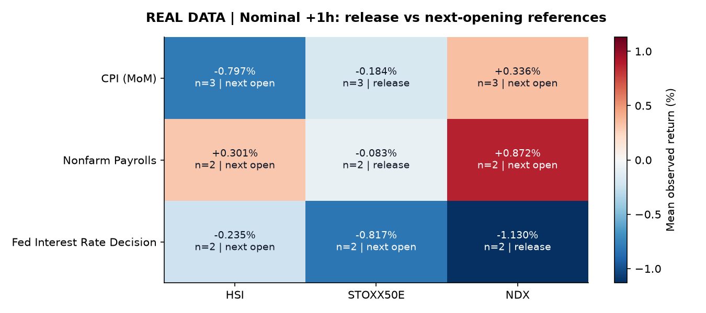
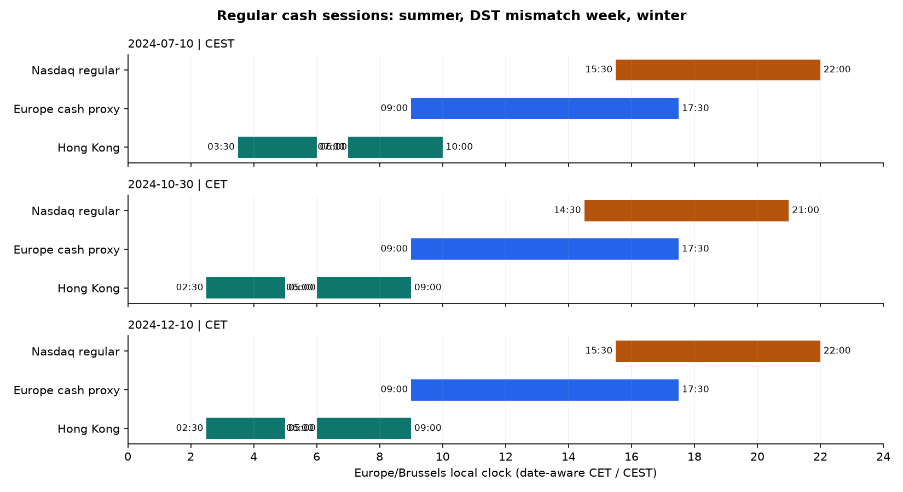

# Real economic-event study

**Question:** how do open cash equity markets respond around economic releases,
and what is observed when closed markets subsequently reopen?

The maintained pipeline was run on actual Yahoo Finance prices and the original
Investing.com economic-calendar archive. `NQ=F` is excluded and replaced by the
Nasdaq-100 cash index `^NDX`. The common observation window is **2024-10-08 through
2024-12-30**. HSI and EURO STOXX 50 come from archived coursework downloads;
Nasdaq-100 hourly data was acquired for this window during the refactor.

## What the numbers mean

The focus panels use U.S. CPI (MoM), Nonfarm Payrolls, and Fed rate decisions,
chosen by economic relevance rather than the size/sign of their observed returns.
The full summary includes all usable timed high-importance events in the window.
For markets **open at release**, the reference is the release timestamp. For
markets **closed at release**, it is the next trading-segment opening. The baseline
is an already observed pre-release price. Reopening returns therefore include
overnight information and unobserved movement, not just the announcement.

The horizontal axis is **hours after the reference**, not necessarily hours after
the announcement. Target observations may be up to 60 minutes late. Actual
mean elapsed time is included in the CSV; the local detailed report retains
every baseline, reference and observed timestamp. Closed-hour targets are missing,
never flat-filled or shifted to another trading day.

There are 1,024 accepted full hourly bars and 124 timed high-importance events.
Partial bars and bars crossing lunch/regular-session boundaries are excluded.
The source archive has no interval-end metadata, so start-labelled 1h bars are an
explicit source convention checked against their market-clock pattern.
Excluding partial bars means a “previous observed close” can precede the actual
session close. This is not a precise closing-auction event study.

Read [observed findings and limitations](findings.md), [methodology](../../docs/real-study.md),
and the [public presentation](../../docs/presentation_public.pdf).

## Artifacts

- `aggregated_responses.csv`: mean, median, n, reference waits, baseline age,
  and actual elapsed time by event family, market, release state, and horizon.
- `focus_1h_summary.csv`: compact focus-event summary used in the heatmap.
- `session_time_examples.csv`: summer, winter, and U.S./Europe DST-mismatch examples.
- PNG/SVG figures and `manifest.json`: provenance, source hashes, exclusions,
  timestamp checkpoints, methodology, artifact sizes and hashes.

Source OHLC and Investing.com calendar records remain local in ignored storage.
The published empirical files are derived analytical summaries; actual / forecast
calendar values are retained in the SQL database, not republished as a source feed.
Provider retention can prevent future redownloads of this exact historical window.

The [synthetic fixture](../README.md) remains a separate offline demonstration.
