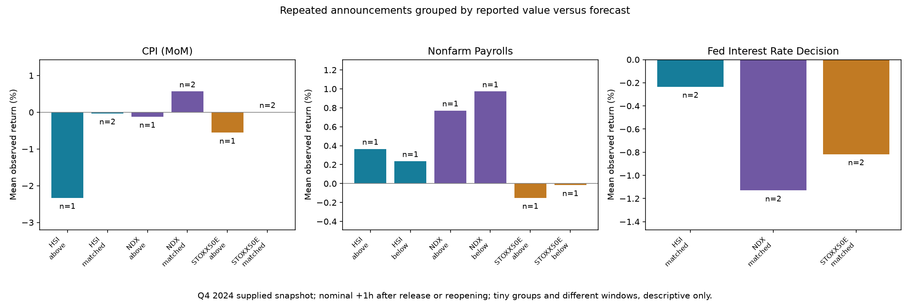

# Repeated events and forecast surprises (optional)

Question: does the observed market response differ between above-, below- and
matched-forecast releases of the same recurring economic indicator?

This module uses an already prepared study DB. It downloads no data and requires
no paid feed. Supplied Yahoo/Investing archives are ingested using the existing
[study source contracts](../../docs/real-study.md); additional licensed historical
data can use those same contracts. The checked-in bundle covers Q4 2024 only.

```sh
python surprise_analysis.py --no-plot
python surprise_analysis.py --db mysql --no-plot --output outputs/mysql_surprises
# Install requirements-report.txt to also generate the comparison image:
python surprise_analysis.py
```

The two derived tables are replaced transactionally on each run. Original prices,
events and event details are unchanged. The module is separate from the default pipeline.

## SQL workflow

1. Python parses signed numbers, valid thousands separators, `%`, `K`, `M`, `B`
   using decimal arithmetic. `1.2M` and `1,200K` are comparable; percent versus a
   plain number is not. Blank values, text/ranges and unit mismatches cannot be
   classified and retain a parse reason. Currency symbols and locale decimal
   conventions outside the contract are unsupported. Input columns must denote
   the same economic quantity within a family; syntax alone cannot verify that.
2. [`surprise_observations.sql`](../../sql/surprise_observations.sql) uses `GROUP BY`
   and `HAVING COUNT(DISTINCT event_timestamp_utc)>=2` to select repeated families.
   `CASE` assigns above/below/matched/unknown; `JOIN` attaches market observations.
3. [`surprise_summary.sql`](../../sql/surprise_summary.sql) partitions by family,
   market, release/open state and surprise category. `ROW_NUMBER()` and `COUNT()`
   windows select the middle return(s) for an exact odd/even median. Conditional
   aggregation gives mean, median, count and direction shares using a ±0.1%
   neutral band. Missing prices are excluded from return denominators.

`numeric_delta` is actual minus forecast, in percentage points for percentages
and scaled numeric units otherwise. It is not a standardized surprise, a relative
percentage change, or a good/bad-news classification. Zero is exact equality at
the archive's reported precision. Previous values are not substituted for forecasts.

Families retain country, MoM/YoY/Core distinctions, and existing quarterly labels.
Fed decisions, FOMC statements, minutes and press conferences are separate families.
Repeated releases need not represent different reporting periods: GDP revisions,
for example, can concern the same quarter. No yearly seasonality is inferred.

## Outputs and observed answer

- [Observations](observations.csv): each repeated event × market, raw and normalized
  announcement values, category, parse status, return status, baseline and actual
  observation timestamps, elapsed time and co-release count.
- [Summary](summary.csv): market/state/category counts, means, medians and positive
  share. Unknown surprise groups are visibly separate and excluded from any
  above/below/matched comparison, not silently discarded.
- [Coverage](coverage.json): 124 source event records, 105 numerically comparable,
  19 missing; 41 repeated families with 121 event records and 351 valid market
  observations out of 363 possible repeated-event × market observations.
- [Manifest](manifest.json): source provenance and exact exported artifact hashes.



For U.S. CPI (MoM), the above-forecast group contains one release: Europe −0.557%,
Nasdaq −0.121%, Hong Kong −2.330%. The matched group contains two releases with
mean returns +0.003%, +0.565% and −0.031% respectively. The above-forecast Hong
Kong observation occurs 86h after release due to a holiday/weekend; the two groups
therefore do not share equivalent information windows. There are no below-forecast
CPI (MoM) releases in this snapshot. Both Fed decisions match forecasts, leaving
no above/below contrast for that family. These are sample findings,
not evidence of a general predictive rule.

Groups use per-indicator event occurrences rather than the country/time clusters
in the [cross-market case analysis](../cases/README.md): no observations are pooled
across families. Co-released indicators can share the same market return and are
not independent evidence. The usual session baselines, opening waits, 60-minute
bar tolerance and missing-target rules still apply. Other news, regional index
composition, long trading gaps and small groups limit interpretation. The archive
is not independently verified as announcement-time unrevised actual/forecast
data, so the results cannot establish real-time forecast performance or causality.
